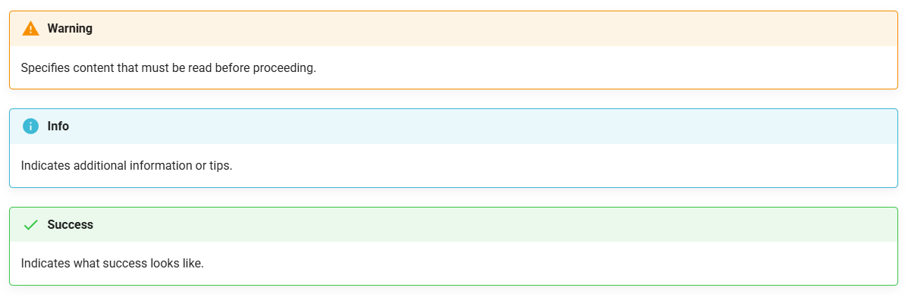

# Overview of Google Sheets User Documentation

This user guide is created as a part of COMM2216 course at BCIT. This user guide is designed to help beginner Google Sheets users enhance their spreadsheet skills for more advanced data analysis.

The following topics are covered in this guide:
 - Sorting and formatting data
 - Using COUNTIF, SUMIF, and AVERAGEIF functions
 - Creating linear regression graphs

## How We Planned and Collaborated
This guide was created by a team of two BCIT CST students. Our main communication tool was Discord, and we held a quick in-person meeting each week to review our work from the previous week and set new goals for the coming week.

We also used Git and GitHub to collaborate on this guide. Although Git and GitHub support some features for resolving any push conflicts, we minimized the conflicts by communicating actively.

## How We Created Our Guide
This guide was created based on the knowledge of Google Sheets we obtained from our previous education and work experience. We reflected on the struggles our classmates experienced when assigned spreadsheet-related tasks in CST Term 1.

### Using MkDocs
We used [Material for MkDocs](https://squidfunk.github.io/mkdocs-material/) for our guide to utilize its powerful environment for creating static documentation websites.

### Using Markdown
The guide is written using Markdown language.

### Using VS Code
VS Code was used to write all Markdown files in this guide. With the MkDocs live serve feature via terminal, we were able to review our changes to the guide real-time.

### Using Git and GitHub
Git and GitHub were used to collaborate on this guide. While we actively communicated to avoid potential push conflicts, Git and GitHub ensured conflict resolution and version control.

## How We Improved Readability

### Graphics Interchange Format (GIF)
As the instructions in this guide require a sequence of menu clicks or typing reference cells directly, we decided to add gifs to help users see the instruction steps more visually.

### Typographical Conventions
We also used typographical conventions throughout the guide to enhance readability and understanding.

* **Bold text** indicates  buttons, menu items, or UI elements you should click
* `Monospace text` represents formulas, functions, or text you need to type
* *Italic text* highlights important new concepts or terms
* > Blockquotes provide examples or sample scenarios
* [Highlighted text](./Glossary.md) leads to our Glossary page or other helpful websites

### Admonitions
Material for MkDocs supports admonition features. We utilized this to warn users, give users helpful tips, and indicate users expected output.

## Conclusion
This project demonstrates our technical writing and documentation skills. This project also tested our group's ability to communicate, since we used an iterative development process that emphasized peer review and continuous improvement of the documentation.

We appreciate your time reading our guide and hope it will be helpful to users.

This document was built on: [Material for MkDocs](https://squidfunk.github.io/mkdocs-material/)