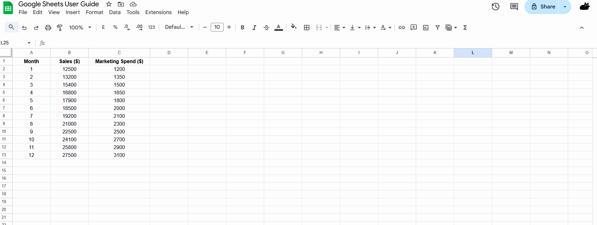

# Linear Regression Graphs
## Overview
[Linear regression](./Glossary.md) is a powerful statistical tool that helps identify relationships between variables. Google Sheets makes it easy to create linear regression graphs that visualize these relationships and calculate trend lines. This feature is particularly useful for forecasting, analyzing correlations, and making data-driven decisions.

In this section, we will provide a step-by-step guide for creating linear regression graphs in Google Sheets. To help you follow each step better, we will use the sample data below for this guide. To use this sample data to follow the guide, simply copy the table below and paste it into your Google Sheets. To create a new Google Sheets, click [here](https://docs.google.com/spreadsheets/create).

| Month | Sales ($) | Marketing Spend ($) |
|:-----:|:---------:|:-------------------:|
|   1   |   12500   |         1200        |
|   2   |   13200   |         1350        |
|   3   |   15400   |         1500        |
|   4   |   16800   |         1650        |
|   5   |   17900   |         1800        |
|   6   |   18500   |         2000        |
|   7   |   19200   |         2100        |
|   8   |   21000   |         2300        |
|   9   |   22500   |         2500        |
|   10  |   24100   |         2700        |
|   11  |   25800   |         2900        |
|   12  |   27500   |         3100        |

!!! info "Info"
    If you encounter any error message or if you do not get the same output while following this guide, check our [troubleshooting](./Troubleshooting.md) page.

## Creating a Scatter Plot
The first step in creating a linear regression graph is to create a [scatter plot](./Glossary.md) of your data.

1. Select the data you want to include in your graph (e.g., select columns B and C to analyze the relationship between Marketing Spend and Sales).
2. Click on **Insert** in the top menu.
3. Select **Chart** from the dropdown menu.
4. In the Chart Editor that appears on the right, go to the **Setup** tab.
5. Under **Chart type**, select **Scatter chart**.

    !!! info "Info"
        Google Sheets will automatically try to determine which column should be on the x-axis and which should be on the y-axis. Typically, the independent variable (Marketing Spend in our example) should be on the x-axis, and the dependent variable (Sales) should be on the y-axis.

6. Verify that your data is correctly assigned. In this example, X-axis should be "Marketing Spend ($)" (column C) and Y-axis should be "Sales ($)" (column B).

    !!! warning "Warning"
        If the axes are reversed, you can change them by clicking on the **Series** section in the Chart Editor and adjusting the X-axis and Y-axis data ranges.

## Adding a Linear Regression Trendline
Once you have created your scatter plot, you can add a linear regression [trendline](./Glossary.md).

1. With your chart selected, click on the three dots (⋮) in the upper right corner of the chart.
2. Select **Edit chart** from the dropdown menu.
3. In the Chart Editor, click on the **Customize** tab.
4. Scroll down and click on **Series**.
5. Scroll down further and click on the **Trend line** checkbox.
6. Ensure the **Type** is set to **Linear**.

    !!! info "Info"
        Google Sheets offers other trendline types such as polynomial, exponential, and logarithmic. For a simple linear regression, select "Linear".

## Displaying the Regression Equation and R² Value
To make your linear regression graph more informative, you can display the equation and [R² value](./Glossary.md).

1. In the Chart Editor, under the **Customize** tab and **Series** section, make sure **Trendline** is expanded.
2. Click the **Label** dropdown menu.
3. From the dropdown menu, select **Use Equation**.
4. Click on the **R²** checkbox.

    !!! info "Info"
        The R² value (coefficient of determination) indicates how well the data fits the regression line. Values closer to 1 indicate a better fit.

## Customizing Your Linear Regression Graph
You can further customize your graph to make it more visually appealing and informative. In the Chart Editor, under the **Customize** tab, you can modify:

* **Chart style**: Change the background colour, border colour, and font.
* **Chart & axis titles**: Add or edit titles for your chart and axes.
* **Series**: Change the colour, point size, and shape of your data points.
* **Trendline**: Adjust the colour, thickness, and style of your trendline.

## Interpreting the Linear Regression Results
Understanding what the regression equation means is crucial for making data-driven decisions.

### The Regression Equation
The linear regression equation has the form: y = mx + b.

* y is the dependent variable (Sales in our example)
* x is the independent variable (Marketing Spend in our example)
* m is the slope (how much y changes when x increases by 1 unit)
* b is the y-intercept (the value of y when x is 0)

### Practical Interpretation
In our example, if the equation is y = 8.5x + 2500.

* For every additional $1 spent on marketing, sales increase by $8.50
* If no money is spent on marketing (x = 0), the baseline sales would be $2,500

### Understanding R² Value
The R² value tells you how much of the variation in y is explained by x. A high R² value (above 0.7) generally indicates a strong relationship between your variables, suggesting that your linear regression model is a good fit for the data.

* R² = 0.95 means that 95% of the variation in sales can be explained by marketing spend in our example
* The remaining 5% is due to other factors not included in the model

## Conclusion
By the end of this section, you will have successfully learned the following:  

- [x] How to create a [scatter plot](./Glossary.md) in Google Sheets
- [x] How to add a [linear regression](./Glossary.md) [trendline](./Glossary.md) to your chart
- [x] How to display and interpret the regression equation and [R² value](./Glossary.md)
- [x] How to customize your [linear regression](./Glossary.md) graph

[Linear regression](./Glossary.md) is a fundamental tool for data analysis that helps you understand relationships between variables and make predictions based on those relationships. With Google Sheets, you can easily create and customize linear regression graphs to gain insights from your data. 