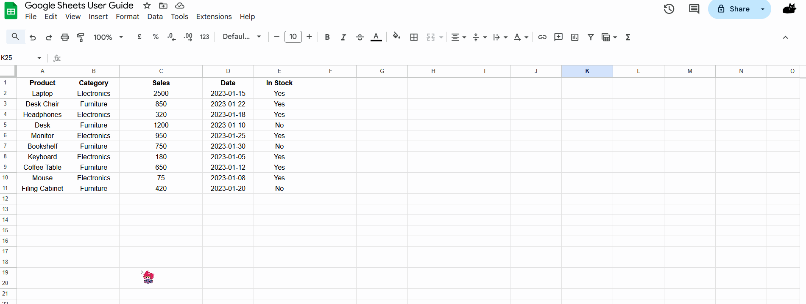
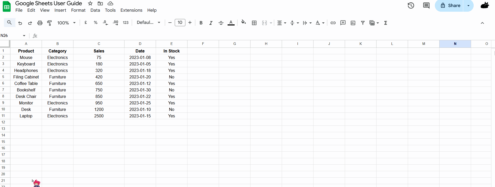
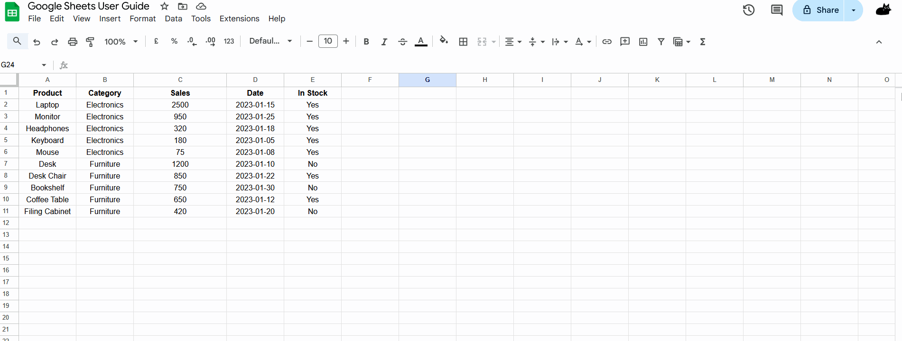
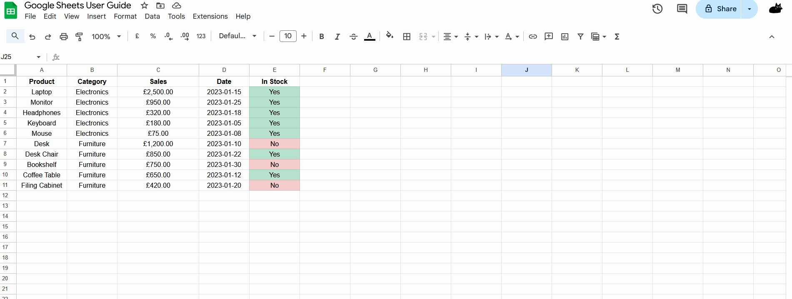
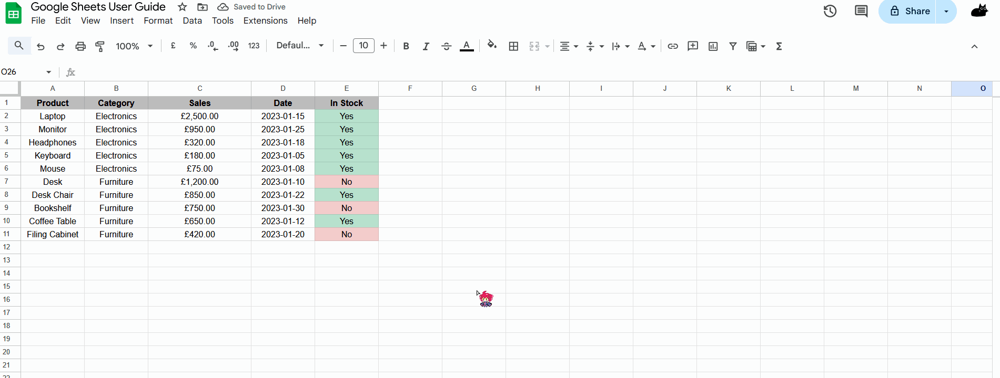
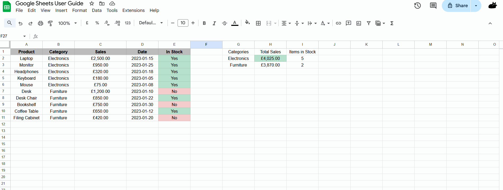
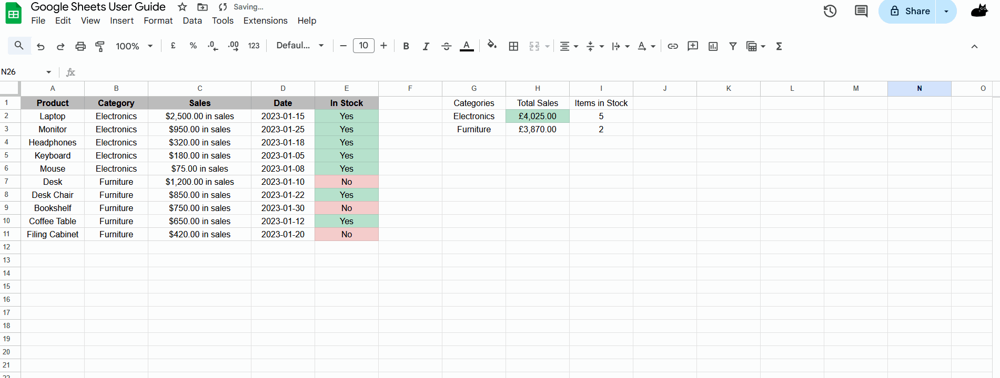

# Sorting and Formatting Data
## Overview
Organizing and presenting data effectively is essential for data analysis. Google Sheets provides powerful tools for sorting and formatting data that can transform raw information into clear, actionable insights. This section will guide you through the process of sorting data and applying formatting to enhance readability and analysis.

In this section, we will provide a step-by-step guide for sorting and formatting data in Google Sheets. To help you follow each step better, we will use the sample data below for this guide.

| Product | Category | Sales | Date | In Stock |
|:-------:|:--------:|:-----:|:----:|:--------:|
| Laptop  | Electronics | 2500 | 2023-01-15 | Yes |
| Desk Chair | Furniture | 850 | 2023-01-22 | Yes |
| Headphones | Electronics | 320 | 2023-01-18 | Yes |
| Desk | Furniture | 1200 | 2023-01-10 | No |
| Monitor | Electronics | 950 | 2023-01-25 | Yes |
| Bookshelf | Furniture | 750 | 2023-01-30 | No |
| Keyboard | Electronics | 180 | 2023-01-05 | Yes |
| Coffee Table | Furniture | 650 | 2023-01-12 | Yes |
| Mouse | Electronics | 75 | 2023-01-08 | Yes |
| Filing Cabinet | Furniture | 420 | 2023-01-20 | No |

## Sorting Data
Sorting data allows you to organize information in a meaningful way, making patterns and trends easier to identify.

### Basic Sorting
> Scenario: You need to sort products by their sales figures from highest to lowest.

1. Select the entire data range (A1:E11 in our example, including headers).
2. Click on **Data** in the top menu.
3. Select **Sort range** from the dropdown menu.

    !!! info "Info"
        You can also right-click on the selected range and choose **Sort range** from the context menu.

4. In the dialog box that appears, check **Data has header row** if your data includes column headers.
5. Select the column you want to sort by (e.g., "Sales").
6. Choose the sort order (A→Z for ascending, Z→A for descending).
7. Click **Sort**.

### Multi-Level Sorting
> Scenario: You need to sort products first by category and then by sales within each category.

1. Select the entire data range.
2. Click on **Data** > **Sort range**.
3. Check **Data has header row**.
4. For "Sort by," select "Category" and choose A→Z (ascending).
5. Click **Add another sort column**.
6. For "Then by," select "Sales" and choose Z→A (descending).
7. Click **Sort**.

    !!! success "Success"
        Your data is now organized by category alphabetically, with products in each category sorted from highest to lowest sales.

### Sorting by Color
If you've applied conditional formatting or manually colored cells, you can sort by color:

1. Select the data range.
2. Click on **Data** > **Create a filter**.
3. Click the filter button (funnel icon) in the header of the column you want to sort.
4. Select **Sort by color**.
5. Choose either **Fill color** or **Text color**.
6. Select the color you want to prioritize in the sorting.

    !!! warning "Warning"
        Sorting by color is only available if you have applied colors to cells in the column you're sorting.

## Formatting Data
Proper formatting enhances readability and helps highlight important information in your data.

### Basic Formatting
> Scenario: You want to format the sales figures as currency and highlight the "In Stock" status.

1. Select the Sales column (C2:C11).
2. Click on **Format** in the top menu.
3. Select **Number** > **Currency**.

    !!! info "Info"
        You can also use the shortcut by clicking the $ icon in the toolbar.

4. Select the "In Stock" column (E2:E11).
5. Click on **Format** > **Conditional formatting**.
6. In the sidebar that appears, set the following:
   - "Format cells if..." to "Text is exactly"
   - Enter "Yes" in the value field
   - Click on "Formatting style" and choose a green fill color
7. Click **Done**.
8. Repeat steps 5-7, but this time set the condition to "Text is exactly" with "No" and choose a red fill color.

### Creating Alternating Row Colors
Alternating row colors can make large datasets easier to read:

1. Select the entire data range (including headers).
2. Click on **Format** > **Alternating colors**.
3. In the sidebar, select a color scheme from the preset options or create a custom one.
4. Click **Done**.

    !!! info "Info"
        You can customize the header color, odd row color, and even row color separately by clicking on each element in the sidebar.

### Number Formatting Options
Google Sheets offers various number formatting options to display your data appropriately:

1. Select the cells you want to format.
2. Click on **Format** > **Number**.
3. Choose from options such as:
   - **Number**: General number format with specified decimal places
   - **Percent**: Displays values as percentages
   - **Currency**: Shows values with currency symbols
   - **Date**: Various date formats
   - **Time**: Various time formats
   - **Custom number format**: Create your own format

    !!! info "Info"
        For dates in our sample data, select column D and apply a date format that matches your preference (e.g., MM/DD/YYYY).

## Creating a Formatted Dashboard
You can combine sorting and formatting techniques to create an effective dashboard:

### Building a Category Summary
1. Create a summary table in a new location (e.g., G1:I4).
2. Add headers: "Category", "Total Sales", "Items in Stock".
3. List unique categories in column G.
4. Use SUMIF to calculate total sales by category in column H:
   `=SUMIF($B$2:$B$11,"Electronics",$C$2:$C$11)` for Electronics
5. Use COUNTIFS to count in-stock items by category in column I:
   `=COUNTIFS($B$2:$B$11,"Electronics",$E$2:$E$11,"Yes")` for Electronics
6. Format the Total Sales column as currency.
7. Apply conditional formatting to highlight categories with high sales.

## Advanced Formatting Techniques

### Custom Number Formats
You can create custom number formats for specific needs:

1. Select the cells to format.
2. Click on **Format** > **Number** > **Custom number format**.
3. Enter a format pattern, such as:
   - `$#,##0.00 "in sales"` to display "$1,200.00 in sales"
   - `0.0%` to show percentages with one decimal place
   - `[>1000]"High";"Low"` to display "High" for values over 1000 and "Low" for others

### Using Data Validation
Data validation helps maintain data integrity:

1. Select a column where you want to restrict input (e.g., the Category column).
2. Click on **Data** > **Data validation**.
3. Set "Criteria" to "Drop-Down".
4. Enter valid categories in each line.
5. See what happens when invalid data is entered.
6. Click **Save**.

    !!! warning "Warning"
        Apply data validation before entering data to ensure consistency throughout your spreadsheet.

## Conclusion
By the end of this section, you will have successfully learned the following:  

- [x] How to sort data using single and multiple criteria
- [x] How to apply number formatting to different types of data
- [x] How to use conditional formatting to highlight important information
- [x] How to create alternating row colors for better readability
- [x] How to build a formatted summary dashboard
- [x] How to implement advanced formatting techniques

Effective sorting and formatting are fundamental skills that transform raw data into meaningful information. By mastering these techniques in Google Sheets, you'll be able to create professional-looking spreadsheets that communicate insights clearly and efficiently. 